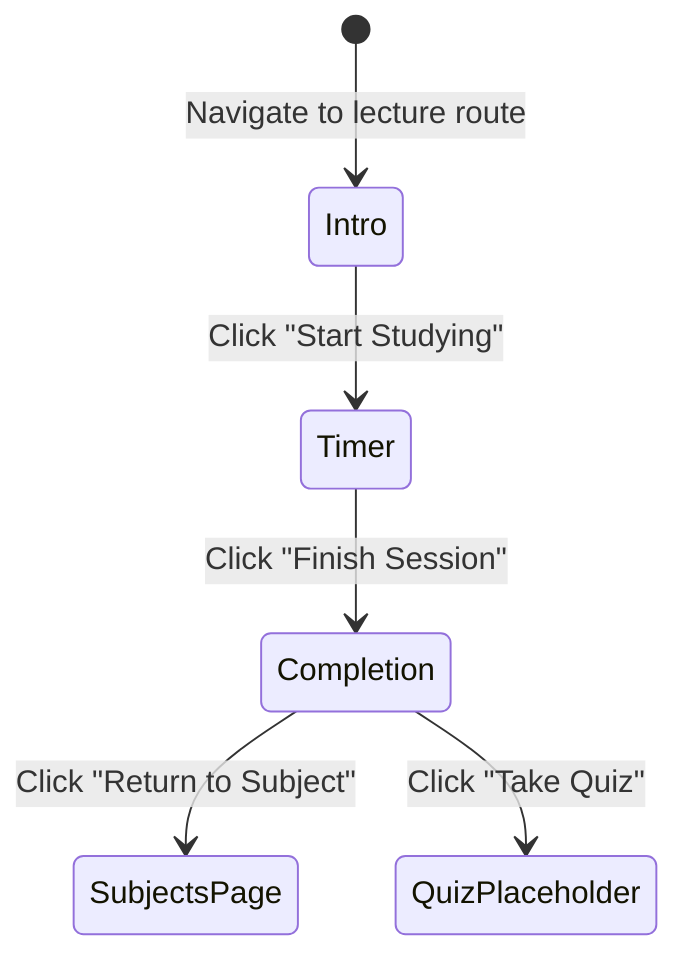

# Data Model: Phase 3 — Workspace Navigation, JSON Ingestion & Study Loop

**Branch**: `003-workspace-nav-json-study` | **Date**: 2026-02-22

---

## TypeScript Interfaces

### LectureImport (Zod-Validated Input)

```typescript
// src/lib/validations/lecture.ts
import { z } from "zod";

export const QuizQuestionSchema = z.object({
  question: z.string().min(1, "Question text is required"),
  options: z.array(z.string().min(1, "Option text is required")).length(4, "Exactly 4 options required"),
  correctAnswer: z.string().min(1, "Correct answer is required"),
}).refine(
  (data) => data.options.includes(data.correctAnswer),
  { message: "correctAnswer must match one of the provided options" }
);

export const LectureImportSchema = z.object({
  title: z.string().min(1, "Lecture title is required"),
  introSummary: z.string().min(1, "Intro summary is required"),
  reflectionQuestions: z
    .array(z.string().min(1, "Reflection question cannot be empty"))
    .length(3, "Exactly 3 reflection questions are required"),
  quizData: z
    .array(QuizQuestionSchema)
    .min(1, "At least 1 quiz question is required"),
});

export type LectureImport = z.infer<typeof LectureImportSchema>;
export type QuizQuestion = z.infer<typeof QuizQuestionSchema>;
```

---

### Lecture (Firestore Document)

```typescript
// src/types/lecture.ts
import { Timestamp } from "firebase/firestore";

export interface Lecture {
  id: string;                        // Firestore document ID
  subjectId: string;                 // Parent subject ID
  workspaceId: string;               // Grandparent workspace ID
  title: string;
  introSummary: string;
  reflectionQuestions: string[];     // Exactly 3 strings
  quizData: QuizQuestion[];          // At least 1
  createdAt: Timestamp;
}

export interface QuizQuestion {
  question: string;
  options: string[];                 // Exactly 4 strings
  correctAnswer: string;             // Must be one of options
}
```

**Firestore Collection**: `/workspaces/{workspaceId}/subjects/{subjectId}/lectures`  
**Security Rule** (minimum): Caller must own the parent workspace.

---

### StudySession (Ephemeral — localStorage)

```typescript
// Referenced in src/hooks/use-study-timer.ts
interface StudySession {
  lectureId: string;
  startTimestamp: number;            // Unix milliseconds (Date.now())
}

// localStorage key: "ofuq_session_${lectureId}"
```

---

## Firestore Collection Summary

| Collection | Key Fields | Query Pattern | ACL |
|---|---|---|---|
| `/workspaces/{id}/subjects/{id}/lectures` | `subjectId`, `workspaceId`, `title`, `createdAt` | `orderBy("createdAt", "desc")` | Owner via workspace |

---

## State Transitions — Study Loop



---

## Route Map

| Route | Page Component | Purpose |
|---|---|---|
| `/workspaces/[id]` | `WorkspacePage` | Overview + Charts (existing) |
| `/workspaces/[id]/subjects` | `SubjectsPage` | List Subjects + Lectures |
| `/workspaces/[id]/board` | `BoardPage` | Whiteboard placeholder |
| `/workspaces/[id]/subjects/[subjectId]/lectures/[lectureId]` | `StudyLoopPage` | 3-step study session |
